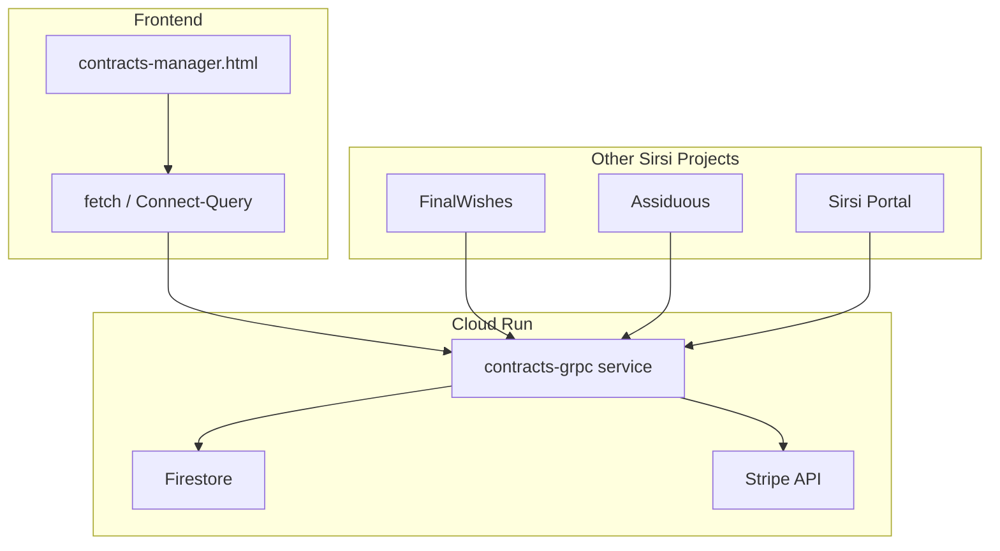

# ADR-004: Contracts gRPC Service

**Status:** Accepted  
**Date:** 2025-12-31  
**Decision Makers:** Architecture Team  
**Related:** ADR-003-HMAC-SECURITY-LAYER

---

## Context

The Sirsi platform needed a standardized way to manage contracts, proposals, and payment workflows across multiple projects (FinalWishes, Assiduous, Sirsi). Previously, contract pages were hardcoded HTML with static payment links. This created maintenance burden and prevented dynamic contract generation.

### Requirements:
1. Dynamic contract creation with customizable theming
2. Template generation for contract pages
3. Stripe payment integration
4. Future bidirectional streaming for chat/events
5. TanStack Query compatibility for frontend

---

## Decision

Deploy a **gRPC-compatible service on Cloud Run** using the Connect protocol.

### Service Details

| Property | Value |
|----------|-------|
| **Service Name** | `contracts-grpc` |
| **URL** | `https://contracts-grpc-210890802638.us-central1.run.app` |
| **Platform** | Google Cloud Run |
| **Region** | us-central1 |
| **Project** | sirsi-nexus-live |

### API Endpoints

| Endpoint | Method | Description |
|----------|--------|-------------|
| `/api/contracts` | POST | Create contract |
| `/api/contracts/list` | GET/POST | List contracts |
| `/sirsi.contracts.v1.ContractsService/CreateContract` | POST | gRPC-style |
| `/sirsi.contracts.v1.ContractsService/GeneratePage` | POST | Generate HTML |
| `/sirsi.contracts.v1.ContractsService/CreateCheckoutSession` | POST | Stripe checkout |
| `/health` | GET | Health check |

---

## Architecture

---

## Theming System

Contracts support customizable themes via CSS variables:

| Variable | Default | Description |
|----------|---------|-------------|
| `--color-primary` | `#C8A951` | Gold accent |
| `--color-secondary` | `#0f172a` | Navy background |
| `--color-accent` | `#10B981` | Emerald accent |
| `--font-heading` | `Cinzel` | Serif headings |
| `--font-body` | `Inter` | Sans-serif body |

---

## Security

1. **TLS 1.3** - Automatic via Cloud Run
2. **CORS** - Configured for Sirsi domains
3. **Authentication** - Service-level (to be added)
4. **HMAC Signing** - Available via ADR-003 integration

---

## Consequences

### Positive
- Centralized contract management across all Sirsi projects
- Dynamic theming without code changes
- Stripe integration built-in
- Future-ready for bidirectional streaming

### Negative
- Requires Cloud Run deployment (additional service)
- Proto files need synchronization across projects

---

## Source Files

- **Service:** `/services/contracts-grpc/`
- **Proto:** `/services/contracts-grpc/proto/contracts/v1/contracts.proto`
- **Admin UI:** `/public/sirsi/contracts-manager.html`
