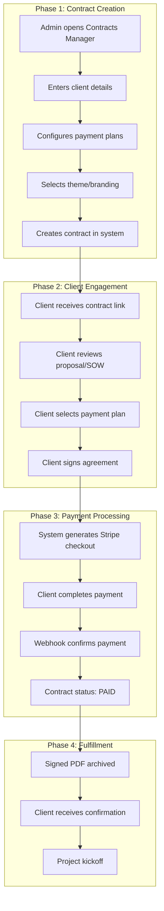
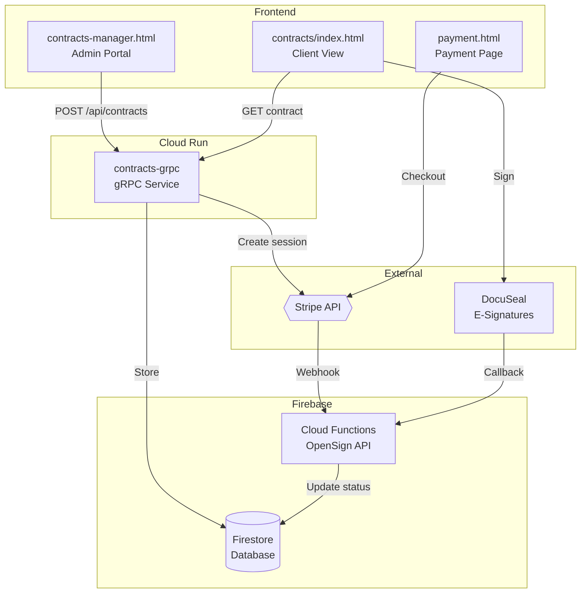
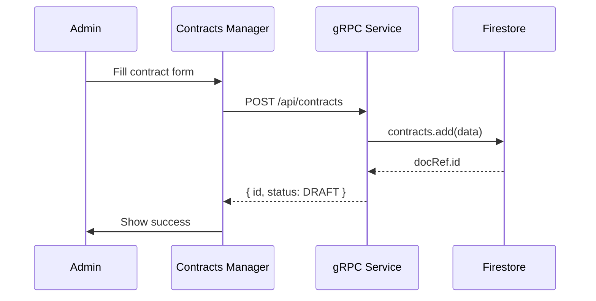
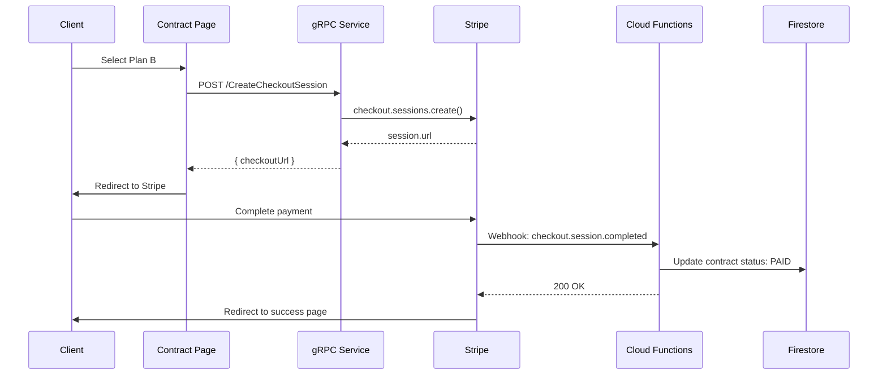
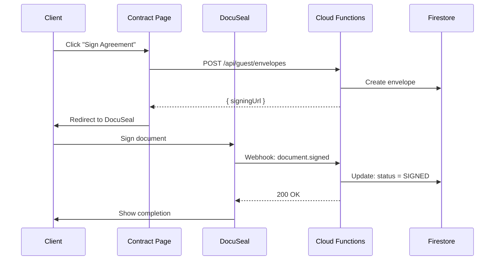

# Payment Workflow Documentation

**Last Updated:** 2025-12-31  
**Owner:** Sirsi Platform Team

---

## Business Workflow

### Overview

The Sirsi payment system enables **dynamic contract-to-payment** flows across all tenant projects (FinalWishes, Assiduous, Sirsi). Administrators define contract terms in the Contracts Manager, and clients receive customized payment options.

### Business Process Flow



### Payment Plans

| Plan | Payments | Example ($200K) | Per Month |
|------|----------|-----------------|-----------|
| Plan A | 4 months | $200,000 | $50,000 |
| Plan B | 5 months | $200,000 | $40,000 |
| Plan C | 6 months | $200,000 | $33,333 |

### Status Lifecycle

```
DRAFT → ACTIVE → SIGNED → PAID → ARCHIVED
```

---

## Technical Workflow

### System Architecture



### API Flow: Create Contract



### API Flow: Payment Checkout



### API Flow: E-Signature



---

## Service Endpoints

### Contracts gRPC Service (Cloud Run)

**URL:** `https://contracts-grpc-210890802638.us-central1.run.app`

| Endpoint | Method | Description |
|----------|--------|-------------|
| `/api/contracts` | POST | Create contract |
| `/api/contracts/list` | POST | List contracts |
| `/sirsi.contracts.v1.ContractsService/GetContract` | POST | Get by ID |
| `/sirsi.contracts.v1.ContractsService/GeneratePage` | POST | Generate HTML |
| `/sirsi.contracts.v1.ContractsService/CreateCheckoutSession` | POST | Stripe checkout |
| `/health` | GET | Health check |

### OpenSign API (Cloud Functions)

**URL:** `https://us-central1-sirsi-opensign.cloudfunctions.net/api`

| Endpoint | Method | Description |
|----------|--------|-------------|
| `/api/guest/envelopes` | POST | Create signing envelope |
| `/api/payments/create-session` | POST | Legacy checkout |
| `/api/payments/webhook` | POST | Stripe webhook |
| `/api/security/verify` | POST | Verify HMAC |

---

## Security

| Layer | Implementation |
|-------|----------------|
| Transport | TLS 1.3 (automatic) |
| Request Auth | HMAC-SHA256 signed tokens |
| Payment | Stripe webhook signature verification |
| CORS | Allowed origins whitelist |

---

## Related Documentation

- [ADR-003: HMAC Security Layer](./ADR-003-HMAC-SECURITY-LAYER.md)
- [ADR-004: Contracts gRPC Service](./ADR-004-CONTRACTS-GRPC-SERVICE.md)
- [Services Registry](./SERVICES_REGISTRY.md)
