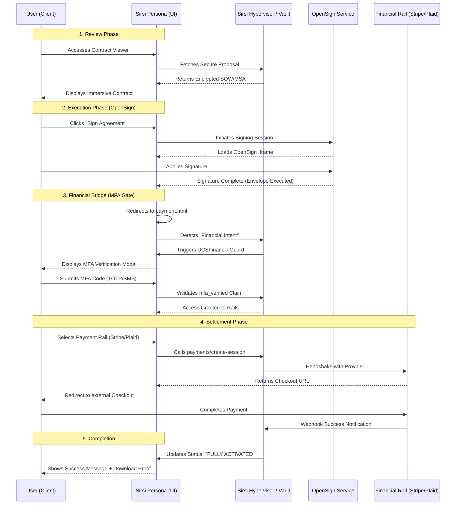

# Signing and Payment Workflow: "The Golden Path"

**Version:** 1.0.0  
**Effective Date:** January 29, 2026  
**Status:** Canonical Implementation

## 1. Executive Summary
This document defines the unified process flow for document execution and financial settlement across the Sirsi Technologies Inc. Portfolio. It ensures that every transaction is **Protected by MFA**, **Audit-Logged**, and **Securely Orchestrated** by the Universal Component System (UCS).

## 2. The Process Flow Diagram

## 3. Workflow States & Visuals

### Phase A: Review & Intent
*   **What the User Sees**: A premium, "Royal Neo-Deco" immersive contract viewer with live price calculations and dynamic SOW sections.
*   **Services Called**: `core-engine` (Rust) for project data, `sirsi-ui` for rendering.

### Phase B: Document Execution (OpenSign)
*   **Internal Role**: OpenSign acts as a standalone service for legal evidence. It can be used for NDAs without payments.
*   **Coupled Role**: When used as part of a Proposal, it is the first "Soft Gate" before payment.
*   **What the User Sees**: A centered signing modal overlay. No technical data or IDs, just the legal document.

### Phase C: The "Universal Guard" (Gate 1)
*   **MFA Requirement**: Any move from signing to payment **MUST** be gated by MFA.
*   **Visual**: A high-fidelity, emerald-accented modal requesting a 6-digit code.
*   **Benefit**: This prevents "Payment Hell" by ensuring only the authorized signer can initiate the payment rail, avoiding unauthorized chargebacks or fraud.

### Phase D: Settlement (Gate 2)
*   **Stripe Rail**: Used for Card and recurring payments.
*   **Plaid/Chase Rail**: Used for high-value ACH and treasury settlement.
*   **What the User Sees**: A secure redirect to the provider's native interface, maintaining trust.

## 4. Orchestration Logic: "Decision Tree"

The system intelligently determines the workflow branch based on the **Handshake Parameters** passed to OpenSign:

1.  **Independent Flow** (e.g., NDA):
    *   **Parameters**: `{ envelopeId, signer }`
    *   **Result**: Upon signing, the session terminates at the "Success" screen. The user can download the PDF. No financial rails are warmed.
2.  **Coupled Flow** (e.g., MSA/SOW):
    *   **Parameters**: `{ envelopeId, amount, plan, ref }`
    *   **Result**: The presence of `amount` triggers the **Financial Bridge**. The countdown timer initiates the redirect to `payment.html`.

## 5. Security & Prevention of "Payment Hell"

To ensure users never feel trapped in a "neverending payment hell":
*   **Session Persistence**: All project context is stored in `sessionStorage`. If the user refreshes `payment.html`, their progress is restored.
*   **Decoupled Failure**: A Stripe failure does NOT invalidate the signature. The user returns to the Payment method selection screen, not the start of the signing process.
*   **Pervasive Audit**: Every state transition (SIGNED -> PAYMENT_PENDING -> SETTLED) is logged by the `useFinancialAudit` stream.

## 6. Service Identification Table

| Service | Responsibility | Trigger Gate |
| :--- | :--- | :--- |
| **OpenSign** | Legal Validity & Signature Proof | User clicks "Sign" |
| **Sirsi Vault** | Secret Storage & Key Management | Calls to Stripe/Plaid API |
| **UCS Guard** | Security Interlocking (MFA/Audit) | Transition to `payment.html` |
| **Stripe** | Card Processing & Subscriptions | User selects "Card Payment" |
| **Plaid/Chase** | Treasury Bridging & Bank Verification | User selects "Bank Wire/ACH" |
| **SendGrid** | Transactional Evidence (Receipts) | Payment Webhook Success |

## 5. Frequently Asked Questions

### Is MFA mandatory for every payment?
**Yes.** Per `SIRSI-ISP-001 Section 10.3`, any financial data interaction requires MFA. This protects both Sirsi Technologies and the Client from unauthorized movement of funds.

### What happens if the payment fails?
The user is redirected to a "Recovery Path" on `payment.html` where they can select an alternative rail (e.g., switch from ACH to Card) without re-signing the MSA. This avoids "Payment Hell."

### Is OpenSign separate?
Yes. OpenSign is designed for **"Integrated Independence."** It can be called as a stand-alone utility (`sign.sirsi.ai`) or as a bridge in a larger financial workflow.
