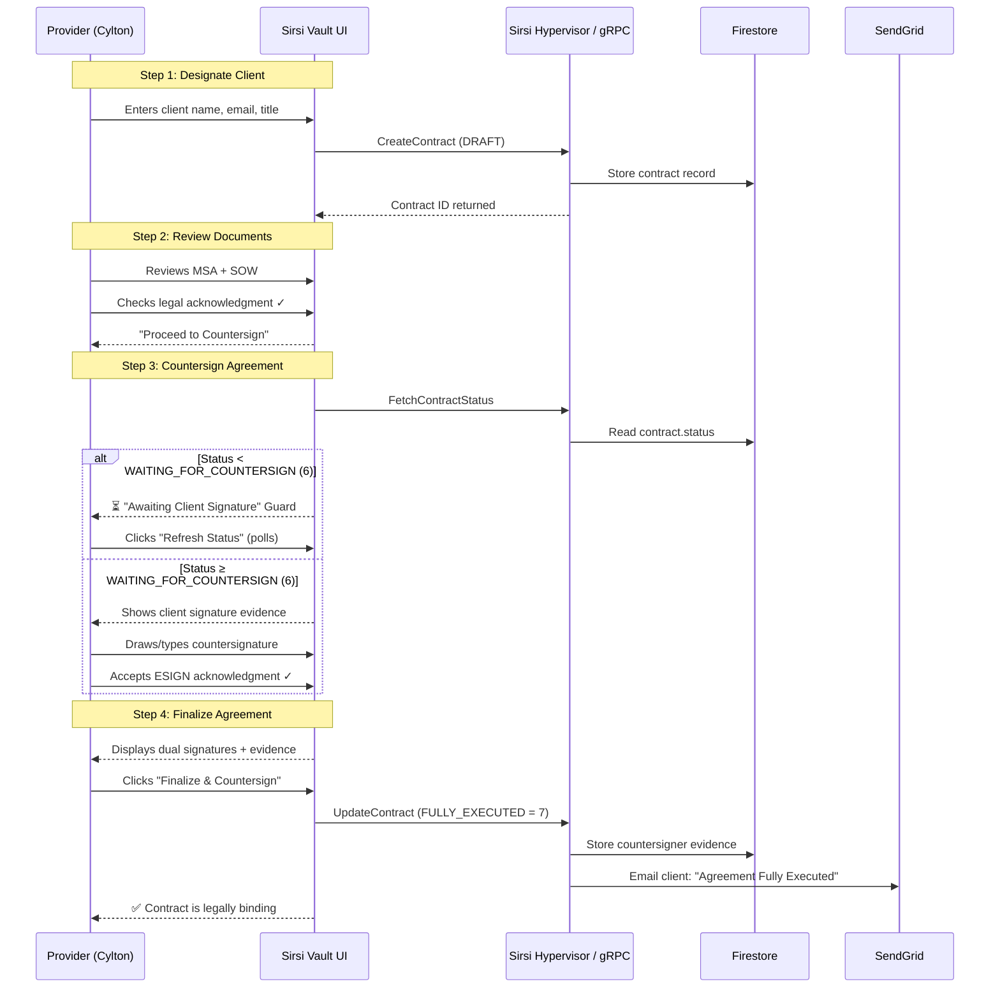
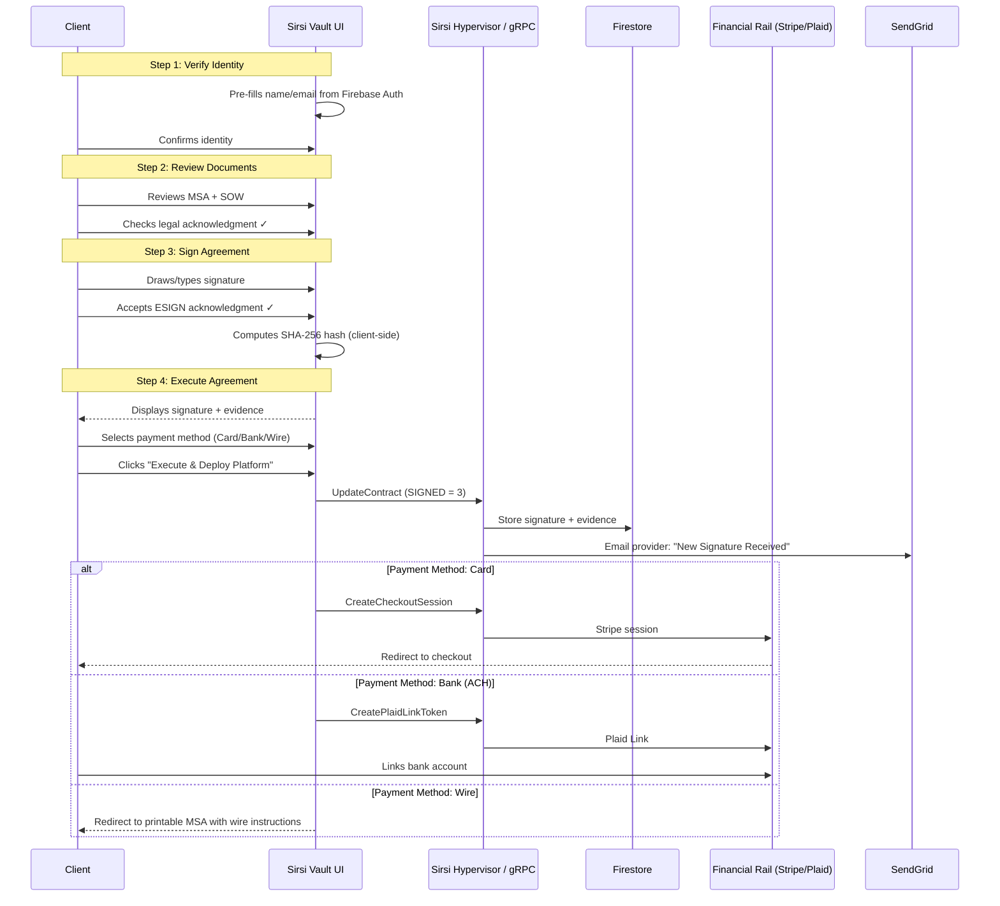

# Signing and Payment Workflow: "The Golden Path"

**Version:** 2.0.0  
**Effective Date:** February 7, 2026  
**Status:** Canonical Implementation  
**Supersedes:** v1.0.0 (January 29, 2026)  
**Related ADR:** [ADR-014 — Bipartite Contract Execution Protocol](../../111-Venture-Projects/docs/ADR-014-BIPARTITE-CONTRACT-EXECUTION.md)

## 1. Executive Summary

This document defines the unified process flow for **bipartite document execution** and financial settlement across the Sirsi Technologies Inc. Portfolio. Version 2.0 introduces the **Dual-Signature Ceremony** — ensuring both the service provider (Sirsi) and the client independently sign the agreement with provable cryptographic evidence before the contract is considered legally binding.

Every transaction is **Protected by MFA**, **Audit-Logged**, and **Securely Orchestrated** by the Universal Component System (UCS).

## 2. Role Resolution

Before any workflow begins, the system resolves the authenticated user's role:

```
┌─────────────────────────────────────────────────────────┐
│                   ROLE RESOLUTION                        │
│                                                          │
│  Firebase Auth User Email                                │
│       │                                                  │
│       ├──→ cylton@sirsi.ai? ──→ PROVIDER                │
│       │                                                  │
│       ├──→ matches contract.clientEmail? ──→ CLIENT     │
│       │                                                  │
│       ├──→ no clientEmail set + is cylton? ──→ PROVIDER │
│       │                                                  │
│       ├──→ no clientEmail set + other? ──→ CLIENT       │
│       │                                                  │
│       └──→ matches neither? ──→ VIEWER (read-only)      │
└─────────────────────────────────────────────────────────┘
```

## 3. The Bipartite Process Flow

### 3.1 Provider Path (Initiator)



### 3.2 Client Path (Signatory)



## 4. Contract Status Lifecycle

```
                    ┌─────────┐
                    │  DRAFT  │ (1) — Contract created
                    └────┬────┘
                         │ Provider designates client
                    ┌────▼────┐
                    │ ACTIVE  │ (2) — Under review
                    └────┬────┘
                         │ Client signs
                    ┌────▼────┐
                    │ SIGNED  │ (3) — Client signature captured
                    └────┬────┘
                         │
              ┌──────────┼──────────┐
              │          │          │
         ┌────▼────┐ ┌──▼───┐ ┌───▼─────┐
         │  PAID   │ │WAIT  │ │ARCHIVED │
         │   (4)   │ │FOR CS│ │   (5)   │
         └─────────┘ │ (6)  │ └─────────┘
                     └──┬───┘
                        │ Provider countersigns
                   ┌────▼──────────┐
                   │FULLY EXECUTED │ (7)
                   │ Both signed   │
                   └───────────────┘
```

### Status Definitions

| Status | Code | Description | Triggered By |
|:---|:---|:---|:---|
| `DRAFT` | 1 | Contract created, pending review | `CreateContract` |
| `ACTIVE` | 2 | Contract active, in review phase | Provider advances to Step 2 |
| `SIGNED` | 3 | Client has signed | `UpdateContract` from client's Step 4 |
| `PAID` | 4 | Payment confirmed (via Stripe webhook) | Stripe `checkout.session.completed` |
| `ARCHIVED` | 5 | Contract archived/inactive | Admin action |
| `WAITING_FOR_COUNTERSIGN` | 6 | Client signed, provider has not | Backend auto-transition on client sign |
| `FULLY_EXECUTED` | 7 | Both parties have signed | Provider's Step 4 "Finalize" |

## 5. Cryptographic Evidence Chain

Each signature produces an independent, tamper-proof evidence record:

```
┌──────────────────────────────────────────────────────┐
│              DUAL EVIDENCE RECORD                     │
│                                                       │
│  CLIENT EVIDENCE                                      │
│  ├─ signatureImageData: "data:image/png;base64,..."  │
│  ├─ signatureHash: "sha256:a1b2c3d4..."              │
│  └─ signedAt: "2026-02-07T14:30:00Z"                │
│                                                       │
│  PROVIDER EVIDENCE                                    │
│  ├─ countersignerSignatureImageData: "data:..."      │
│  ├─ countersignerSignatureHash: "sha256:e5f6g7h8..." │
│  └─ countersignerSignedAt: "2026-02-07T16:45:00Z"   │
│                                                       │
│  SHARED                                               │
│  ├─ contractId: "Abu6GsULzDvvXWT2NFaB"               │
│  └─ envelopeId: "ENV-{contractId}"                   │
└──────────────────────────────────────────────────────┘
```

**Hash Algorithm:** SHA-256 via `crypto.subtle.digest()` on the Base64 signature image data.

## 6. The Countersign Gate (Provider Step 3)

The provider's Step 3 includes a **status guard** that prevents premature countersigning:

| Contract Status | Provider Step 3 Behavior |
|:---|:---|
| `DRAFT`, `ACTIVE` | ⏳ "Awaiting Client Signature" — signature pad hidden |
| `WAITING_FOR_COUNTERSIGN` | ✅ Client signature displayed as evidence — countersign pad visible |
| `FULLY_EXECUTED` | 🔒 Both signatures displayed — no further action |

The guard includes a **"Refresh Status"** button that calls `fetchContractStatus()` to poll the backend for updates.

## 7. Orchestration Logic: Decision Tree (v2)

```
                    ┌──────────────┐
                    │ User Clicks  │
                    │   "Sign"     │
                    └──────┬───────┘
                           │
                    ┌──────▼───────┐
                    │ Resolve Role │
                    └──────┬───────┘
                           │
              ┌────────────┼────────────┐
              │                         │
       ┌──────▼──────┐          ┌──────▼──────┐
       │  PROVIDER   │          │   CLIENT    │
       │  Designate  │          │   Verify    │
       │  → Review   │          │   → Review  │
       │  → Counter  │          │   → Sign    │
       │  → Finalize │          │   → Execute │
       └──────┬──────┘          └──────┬──────┘
              │                         │
              │ No Payment              │ Payment
              │                         │
       ┌──────▼──────┐          ┌──────▼──────┐
       │   Status:   │          │  Financial  │
       │   FULLY_    │          │   Bridge    │
       │  EXECUTED   │          │  (MFA Gate) │
       └─────────────┘          └──────┬──────┘
                                       │
                          ┌────────────┼────────────┐
                          │            │            │
                   ┌──────▼──┐  ┌─────▼────┐ ┌────▼────┐
                   │  Card   │  │  ACH/    │ │  Wire   │
                   │ Stripe  │  │  Plaid   │ │ Manual  │
                   └─────────┘  └──────────┘ └─────────┘
```

**Key Distinction:** The provider path **never enters the Financial Bridge**. Only the client (payer) role triggers MFA → Payment → Settlement.

## 8. Email Notification Matrix

| Event | Trigger | Recipient | Subject |
|:---|:---|:---|:---|
| Client signs | `UpdateContract(status=SIGNED)` | Provider | `✍️ New Signature: {projectName}` |
| Provider countersigns | `UpdateContract(status=FULLY_EXECUTED)` | Client | `✅ Agreement Fully Executed: {projectName}` |
| Payment received | Stripe webhook | Client | `💰 Payment Confirmed: {projectName}` |

## 9. Security Principles

1. **MFA Gate**: Any transition from signing to payment requires TOTP verification (`mfaVerifiedForFinancial`).
2. **Role Isolation**: Provider cannot trigger payment. Client cannot countersign.
3. **Session Persistence**: All context stored in `sessionStorage` — refresh preserves state.
4. **Decoupled Failure**: A Stripe failure does NOT invalidate either signature.
5. **Pervasive Audit**: Every status transition is logged with timestamp and user identity.

## 10. Service Identification Table

| Service | Responsibility | Trigger Gate |
|:---|:---|:---|
| **SirsiVault.tsx** | Role resolution, dual-step UI, evidence computation | User clicks "Sign" from Vault |
| **contracts-grpc** | Status transitions, countersigner storage, email dispatch | Frontend `UpdateContract` call |
| **OpenSign** (planned) | Legal Validity & PDF Signature Proof | Future integration |
| **UCS Guard** | Security Interlocking (MFA/Audit) | Client → Payment transition |
| **Stripe** | Card Processing & Subscriptions | Client selects "Card Payment" |
| **Plaid/Chase** | Treasury Bridging & Bank Verification | Client selects "Bank Wire/ACH" |
| **SendGrid** | Transactional Evidence (Receipts) | Status transition events |

## 11. Implementation Artifacts

| Artifact | Path | Role |
|:---|:---|:---|
| Proto Schema | `packages/finalwishes-contracts/proto/contracts/v1/contracts.proto` | Status enum, countersigner fields |
| Frontend | `packages/finalwishes-contracts/src/components/tabs/SirsiVault.tsx` | Role detection, dual-step UI |
| Backend | `packages/sirsi-opensign/services/contracts-grpc/src/server.js` | Status normalization, email dispatch |
| gRPC Client | `packages/finalwishes-contracts/src/lib/grpc.ts` | Auth-intercepted Connect client |
| ADR | `111-Venture-Projects/docs/ADR-014-BIPARTITE-CONTRACT-EXECUTION.md` | Decision record |

---

*Version 2.0.0 — Bipartite Contract Execution Protocol — February 7, 2026*
