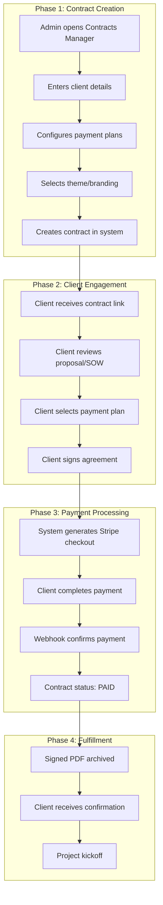
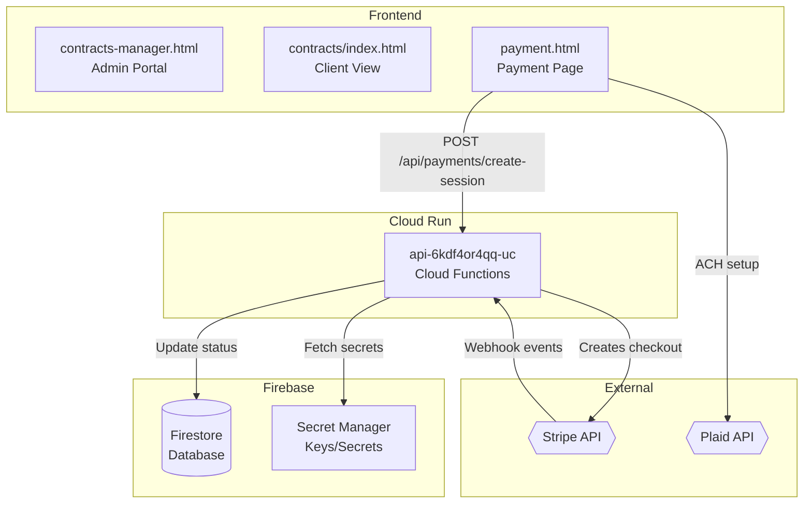
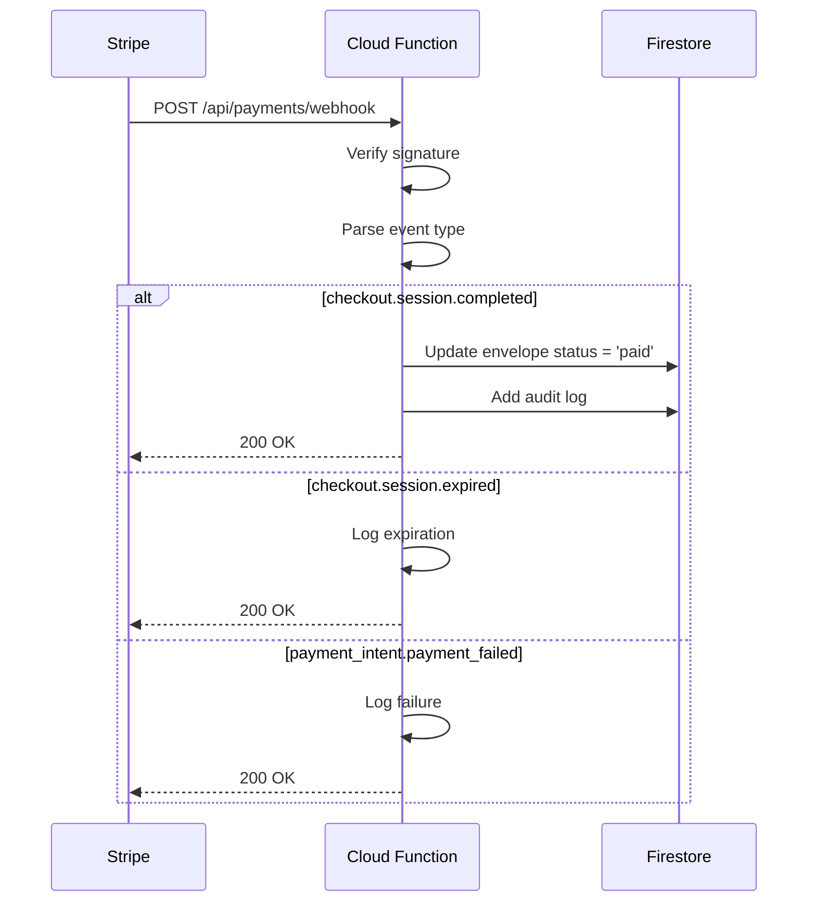

# Payment Workflow Documentation

**Version:** 2.1.0  
**Last Updated:** 2026-01-17  
**Owner:** Sirsi Platform Team  
**Status:** ✅ PRODUCTION LIVE

---

## Table of Contents

1. [Executive Summary](#executive-summary)
2. [Business Workflow](#business-workflow)
3. [Technical Architecture](#technical-architecture)
4. [Stripe Configuration](#stripe-configuration)
5. [Environment Switching](#environment-switching)
6. [Security Implementation](#security-implementation)
7. [API Reference](#api-reference)
8. [Secrets Management](#secrets-management)
9. [Webhook Configuration](#webhook-configuration)
10. [Testing Guide](#testing-guide)
11. [Troubleshooting](#troubleshooting)
12. [Related Documentation](#related-documentation)

---

## Executive Summary

The Sirsi payment system is a **multi-tenant, dynamic contract-to-payment platform** supporting:

- **Stripe Checkout** for card and ACH payments
- **Live/Test mode switching** via environment configuration
- **Webhook-driven** payment status updates
- **Secure bank transfers** via Plaid integration
- **Multi-project architecture** (FinalWishes, Assiduous, Sirsi)

### Current Status

| Component | Status | Mode |
|-----------|--------|------|
| Stripe Integration | ✅ Live | LIVE 💰 |
| Webhook Endpoint | ✅ Active | 3 events |
| ACH/Bank Transfers | ✅ Enabled | Plaid |
| Test Mode | ✅ Ready | Switchable |

---

## Business Workflow

### Overview

Administrators define contract terms in the Contracts Manager, and clients receive customized payment options with multiple payment plans.

### Business Process Flow



### Payment Plans (FinalWishes Core Platform)

| Plan | Payments | Total | Per Payment |
|------|----------|-------|-------------|
| Plan 1 | 2 payments | $95,000 | $47,500 |
| Plan 2 | 3 monthly | $95,000 | $31,666 |
| Plan 3 | 4 monthly | $95,000 | $23,750 |

### Status Lifecycle

```
DRAFT → ACTIVE → SIGNED → PAID → ARCHIVED
```

---

## Technical Architecture

### System Components



### Key Files

| File | Purpose |
|------|---------|
| `functions/index.js` | Cloud Functions with Stripe integration |
| `public/payment.html` | Client payment page |
| `public/success.html` | Payment confirmation page |

---

## Stripe Configuration

### Account Details

| Field | Value |
|-------|-------|
| **Business Name** | Sirsi Technologies, Inc |
| **URL** | Sirsi.ai |
| **Address** | 909 Rose Ave, Suite 400, North Bethesda, MD 20852 US |
| **Support Phone** | +1 (202) 747-4787 |
| **Statement Descriptor** | SIRSI TECHNOLOGIES INC |

### API Keys Structure

| Key Type | Prefix | Purpose |
|----------|--------|---------|
| Publishable Key (Live) | `pk_live_` | Client-side Stripe.js |
| Secret Key (Live) | `sk_live_` | Server-side API calls |
| Publishable Key (Test) | `pk_test_` | Test mode client-side |
| Secret Key (Test) | `sk_test_` | Test mode server-side |
| Webhook Secret | `whsec_` | Webhook signature verification |

### Payment Methods Enabled

- ✅ Cards (Visa, Mastercard, Amex, Discover)
- ✅ US Bank Account (ACH)
- ✅ Link (Stripe's fast checkout)

---

## Environment Switching

### How It Works

The system uses a `STRIPE_USE_LIVE` secret to toggle between live and test modes:

```javascript
// In functions/index.js
const USE_LIVE_STRIPE = process.env.STRIPE_USE_LIVE === 'true';

const STRIPE_KEY = USE_LIVE_STRIPE 
  ? process.env.STRIPE_SECRET_KEY
  : process.env.STRIPE_SECRET_KEY_TEST;
```

### Switch to TEST Mode

```bash
# Set STRIPE_USE_LIVE to 'false'
echo "false" | gcloud secrets versions add STRIPE_USE_LIVE \
  --project=sirsi-nexus-live --data-file=-

# Redeploy functions
firebase deploy --only functions --project sirsi-nexus-live
```

### Switch to LIVE Mode

```bash
# Set STRIPE_USE_LIVE to 'true'
echo "true" | gcloud secrets versions add STRIPE_USE_LIVE \
  --project=sirsi-nexus-live --data-file=-

# Redeploy functions
firebase deploy --only functions --project sirsi-nexus-live
```

### Verify Current Mode

```bash
curl -s https://api-6kdf4or4qq-uc.a.run.app/api/health | jq .stripeMode
# Returns: "LIVE" or "TEST"
```

---

## Security Implementation

### Bank Wire Security (Remediated Jan 2026)

**CRITICAL**: Bank routing and account numbers are **NEVER** displayed in plaintext.

| Previous (Insecure) | Current (Secure) |
|---------------------|------------------|
| Plaintext bank details in UI | ACH via Stripe + Plaid |
| Wire info in PDF invoices | Contact accounts@sirsi.ai |
| No audit logging | Full audit trail |

### Secure Bank Transfer Flow

1. **ACH Option**: Stripe + Plaid integration for secure bank linking
2. **Wire Option**: Request via secure email only after identity verification
3. **Audit**: All wire instruction requests logged to Firestore

### Webhook Security

All webhooks are verified using Stripe's signature verification:

```javascript
const sig = req.headers['stripe-signature'];
const event = stripe.webhooks.constructEvent(
  req.rawBody, 
  sig, 
  STRIPE_WEBHOOK_SECRET
);
```

---

## API Reference

### Base URL

```
https://api-6kdf4or4qq-uc.a.run.app
```

### Endpoints

#### Health Check

```
GET /api/health
```

Response:
```json
{
  "status": "healthy",
  "service": "sirsi-opensign",
  "stripeConfigured": true,
  "stripeMode": "LIVE",
  "timestamp": "2026-01-13T19:48:34.856Z"
}
```

#### Create Checkout Session

```
POST /api/payments/create-session
Content-Type: application/json

{
  "envelopeId": "abc123",
  "amount": 50000,
  "plan": "Plan A",
  "successUrl": "https://sign.sirsi.ai/success.html",
  "cancelUrl": "https://sign.sirsi.ai/payment.html"
}
```

Response:
```json
{
  "checkoutUrl": "https://checkout.stripe.com/c/pay/cs_live_...",
  "sessionId": "cs_live_..."
}
```

#### Get Payment Status

```
GET /api/payments/status/:envelopeId
```

Response:
```json
{
  "status": "paid",
  "paymentMetadata": {
    "stripeSessionId": "cs_live_...",
    "amountPaid": 5000000,
    "paidAt": "2026-01-13T19:48:34.856Z"
  }
}
```

#### Request Wire Instructions (Secure)

```
POST /api/payments/request-wire-instructions
Content-Type: application/json

{
  "envelopeId": "abc123",
  "email": "client@example.com"
}
```

Response:
```json
{
  "success": true,
  "message": "Wire instructions will be sent to your email"
}
```

#### Stripe Webhook

```
POST /api/payments/webhook
```

Handled events:
- `checkout.session.completed`
- `checkout.session.expired`
- `payment_intent.payment_failed`

---

## Secrets Management

### Firebase Secret Manager (sirsi-nexus-live)

| Secret Name | Purpose | Mode |
|-------------|---------|------|
| `STRIPE_SECRET_KEY` | Live API secret key | LIVE |
| `STRIPE_WEBHOOK_SECRET` | Live webhook signing secret | LIVE |
| `STRIPE_SECRET_KEY_TEST` | Test API secret key | TEST |
| `STRIPE_WEBHOOK_SECRET_TEST` | Test webhook signing secret | TEST |
| `STRIPE_USE_LIVE` | Mode toggle (`true`/`false`) | Both |
| `STRIPE_PUBLISHABLE_KEY` | Live publishable key | LIVE |
| `MAIL_USER` | Email sending account | Both |
| `MAIL_PASS` | Email password | Both |

### Local Encrypted Backup

Location: `~/.sirsi/secrets/stripe_live.enc`

**Decryption:**
```bash
MACHINE_KEY=$(hostname | shasum -a 256 | cut -c1-32)
openssl enc -aes-256-cbc -d -pbkdf2 \
  -in ~/.sirsi/secrets/stripe_live.enc \
  -k "$MACHINE_KEY"
```

### Adding/Updating Secrets

```bash
# Add new version
echo "new_secret_value" | tr -d '\n' | \
  gcloud secrets versions add SECRET_NAME \
  --project=sirsi-nexus-live --data-file=-

# View current value (requires access)
gcloud secrets versions access latest \
  --secret=SECRET_NAME --project=sirsi-nexus-live
```

---

## Webhook Configuration

### Stripe Dashboard Configuration

**Endpoint URL:**
```
https://api-6kdf4or4qq-uc.a.run.app/api/payments/webhook
```

**Events Subscribed:**
- `checkout.session.completed` - Payment successful
- `checkout.session.expired` - Session timed out
- `payment_intent.payment_failed` - Payment failed

### Webhook Handler Flow



---

## Testing Guide

### Test Card Numbers

| Card | Number | Result |
|------|--------|--------|
| Visa (Success) | `4242 4242 4242 4242` | Succeeds |
| Visa (Declined) | `4000 0000 0000 0002` | Declined |
| Require Auth | `4000 0025 0000 3155` | 3D Secure |

### Test Bank Account (ACH)

| Routing | Account | Result |
|---------|---------|--------|
| `110000000` | `000123456789` | Success |

### Test Credentials

| Field | Value |
|-------|-------|
| Name | Cylton Collymore |
| Email | cylton@sirsi.ai |

### End-to-End Test Flow

1. **Switch to TEST mode:**
   ```bash
   echo "false" | gcloud secrets versions add STRIPE_USE_LIVE \
     --project=sirsi-nexus-live --data-file=-
   firebase deploy --only functions --project sirsi-nexus-live
   ```

2. **Verify TEST mode:**
   ```bash
   curl -s https://api-6kdf4or4qq-uc.a.run.app/api/health | jq .stripeMode
   # Should return: "TEST"
   ```

3. **Create test payment:**
   - Navigate to: `https://sign.sirsi.ai/payment.html?amount=100&plan=Test`
   - Use test card: `4242 4242 4242 4242`
   - Complete checkout

4. **Verify webhook received:**
   ```bash
   # Check Stripe Dashboard → Developers → Webhooks → Events
   ```

5. **Switch back to LIVE:**
   ```bash
   echo "true" | gcloud secrets versions add STRIPE_USE_LIVE \
     --project=sirsi-nexus-live --data-file=-
   firebase deploy --only functions --project sirsi-nexus-live
   ```

---

## Troubleshooting

### Common Issues

#### "stripeConfigured: false"

**Cause:** Secrets not accessible to Cloud Function

**Solution:**
```bash
# Verify secrets exist
gcloud secrets list --project=sirsi-nexus-live

# Redeploy to bind secrets
firebase deploy --only functions --project sirsi-nexus-live
```

#### Webhook Signature Verification Failed

**Cause:** Wrong webhook secret or raw body not preserved

**Solution:**
1. Verify webhook secret in Stripe Dashboard matches Firebase secret
2. Ensure Express preserves raw body for webhook route

#### TimeoutError on Create Session

**Cause:** Network issues or Stripe API problems

**Solution:**
1. Check Stripe status: https://status.stripe.com
2. Retry the request
3. Check function logs in GCP Console

### Log Access

```bash
# View function logs
gcloud functions logs read api \
  --project=sirsi-nexus-live \
  --region=us-central1 \
  --limit=50
```

---

## Related Documentation

- [ADR-003: HMAC Security Layer](./ADR-003-HMAC-SECURITY-LAYER.md)
- [ADR-004: Contracts gRPC Service](./ADR-004-CONTRACTS-GRPC-SERVICE.md)
- [ADR-005: Stripe Environment Switching](./ADR-005-STRIPE-ENVIRONMENT.md)
- [Services Registry](./SERVICES_REGISTRY.md)

---

## Changelog

| Version | Date | Author | Changes |
|---------|------|--------|---------|
| 2.1.0 | 2026-01-17 | Antigravity | Updated payment plans to $95K Core with 2/3/4 payment options |
| 2.0.0 | 2026-01-13 | Antigravity | Complete rewrite with live Stripe, env switching, security remediation |
| 1.0.0 | 2025-12-31 | Sirsi Team | Initial documentation |

---

**Document Classification:** INTERNAL - CANONICAL SOURCE OF TRUTH  
**Maintained By:** Sirsi Platform Engineering  
**Last Verified:** 2026-01-13T14:52:00-05:00
