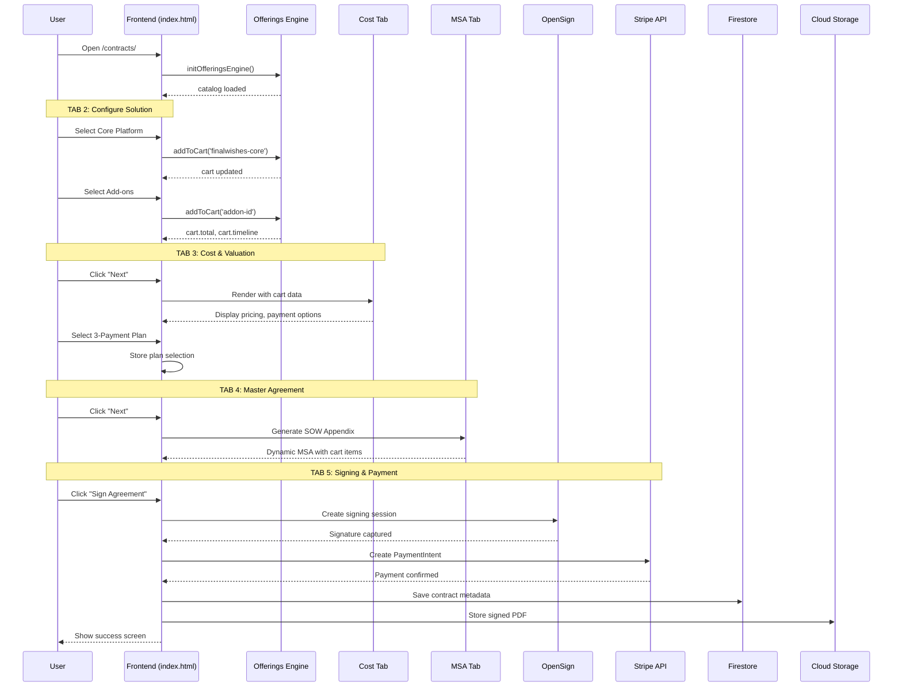
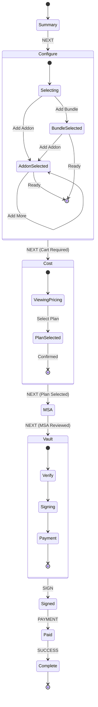

```mermaid
flowchart TB
    subgraph ENTRY["🚪 User Entry"]
        A["/contracts/"]
    end

    subgraph TAB1["📋 TAB 1: Executive Summary"]
        B1[Project Overview]
        B2[Strategic Objectives]
        B3[Client Partnership Context]
    end

    subgraph TAB2["âš™ï¸ TAB 2: Configure Solution"]
        direction TB
        C1["1. Choose Your Path"]
        C2{"Bundle or\nStandalone?"}
        C3["Core Platform\n$95,000"]
        C4["À La Carte\n$18K+ per module"]
        C5["2. Strategic Add-On Modules"]
        C6["Add-on Grid\n(Offerings Engine)"]
        C7["3. Selection Summary"]
        C8["Cart State\n(Total + Timeline)"]
        
        C1 --> C2
        C2 -->|"Bundle"| C3
        C2 -->|"Standalone"| C4
        C3 --> C5
        C4 --> C5
        C5 --> C6
        C6 --> C7
        C7 --> C8
    end

    subgraph TAB3["💰 TAB 3: Cost & Valuation"]
        direction TB
        D1["1. Market Analysis"]
        D2["2. Atomic Breakdown"]
        D3["3. Value Realization"]
        D4["4. Technology BoM"]
        D5["5. Payment Options"]
        D6{"Select Plan\n2/3/4 Payments"}
        
        D1 --> D2 --> D3 --> D4 --> D5 --> D6
    end

    subgraph TAB4["📜 TAB 4: Master Agreement"]
        direction TB
        E1["MSA Sections 1-11"]
        E2["APPENDIX A: SOW\n(Generated from Cart)"]
        E3["APPENDIX B: Cost Proposal\n(Generated from Cart)"]
        
        E1 --> E2 --> E3
    end

    subgraph TAB5["âœï¸ TAB 5: Sirsi Vault"]
        direction TB
        F1["Step 1: Verify Selections"]
        F2["Step 2: E-Signature\n(OpenSign)"]
        F3["Step 3: Payment\n(Stripe)"]
        
        F1 --> F2 --> F3
    end

    subgraph POST["✅ Post-Execution"]
        G1["PDF to Cloud Storage"]
        G2["Email via SendGrid"]
        G3["Metadata to Firestore"]
    end

    A --> TAB1
    TAB1 -->|"NEXT →"| TAB2
    TAB2 -->|"Cart Data"| TAB3
    TAB3 -->|"Plan Selection"| TAB4
    TAB4 -->|"Contract Ready"| TAB5
    TAB5 -->|"Success"| POST

    style TAB1 fill:#1e3a5f,stroke:#C8A951
    style TAB2 fill:#1e3a5f,stroke:#10B981
    style TAB3 fill:#1e3a5f,stroke:#C8A951
    style TAB4 fill:#1e3a5f,stroke:#C8A951
    style TAB5 fill:#1e3a5f,stroke:#10B981
    style POST fill:#10B981,stroke:#fff
```

## Data Flow Diagram

```mermaid
sequenceDiagram
    participant U as User
    participant FE as Frontend (index.html)
    participant OE as Offerings Engine
    participant TAB3 as Cost Tab
    participant TAB4 as MSA Tab
    participant OS as OpenSign
    participant Stripe as Stripe API
    participant FS as Firestore
    participant CS as Cloud Storage

    U->>FE: Open /contracts/
    FE->>OE: initOfferingsEngine()
    OE-->>FE: catalog loaded

    Note over U,FE: TAB 2: Configure Solution
    U->>FE: Select Core Platform
    FE->>OE: addToCart('finalwishes-core')
    OE-->>FE: cart updated
    U->>FE: Select Add-ons
    FE->>OE: addToCart('addon-id')
    OE-->>FE: cart.total, cart.timeline

    Note over U,TAB3: TAB 3: Cost & Valuation
    U->>FE: Click "Next"
    FE->>TAB3: Render with cart data
    TAB3-->>FE: Display pricing, payment options
    U->>FE: Select 3-Payment Plan
    FE->>FE: Store plan selection

    Note over U,TAB4: TAB 4: Master Agreement
    U->>FE: Click "Next"
    FE->>TAB4: Generate SOW Appendix
    TAB4-->>FE: Dynamic MSA with cart items

    Note over U,Stripe: TAB 5: Signing & Payment
    U->>FE: Click "Sign Agreement"
    FE->>OS: Create signing session
    OS-->>FE: Signature captured
    FE->>Stripe: Create PaymentIntent
    Stripe-->>FE: Payment confirmed
    FE->>FS: Save contract metadata
    FE->>CS: Store signed PDF
    FE-->>U: Show success screen
```

## State Machine

```mermaid
stateDiagram-v2
    [*] --> Summary
    Summary --> Configure: NEXT
    Configure --> Cost: NEXT (Cart Required)
    Cost --> MSA: NEXT (Plan Selected)
    MSA --> Vault: NEXT (MSA Reviewed)
    Vault --> Signed: SIGN
    Signed --> Paid: PAYMENT
    Paid --> Complete: SUCCESS
    Complete --> [*]

    state Configure {
        [*] --> Selecting
        Selecting --> BundleSelected: Add Bundle
        Selecting --> AddonSelected: Add Addon
        BundleSelected --> AddonSelected: Add Addon
        AddonSelected --> AddonSelected: Add More
        AddonSelected --> [*]: Ready
        BundleSelected --> [*]: Ready
    }

    state Cost {
        [*] --> ViewingPricing
        ViewingPricing --> PlanSelected: Select Plan
        PlanSelected --> [*]: Confirmed
    }

    state Vault {
        [*] --> Verify
        Verify --> Signing
        Signing --> Payment
        Payment --> [*]
    }
```
